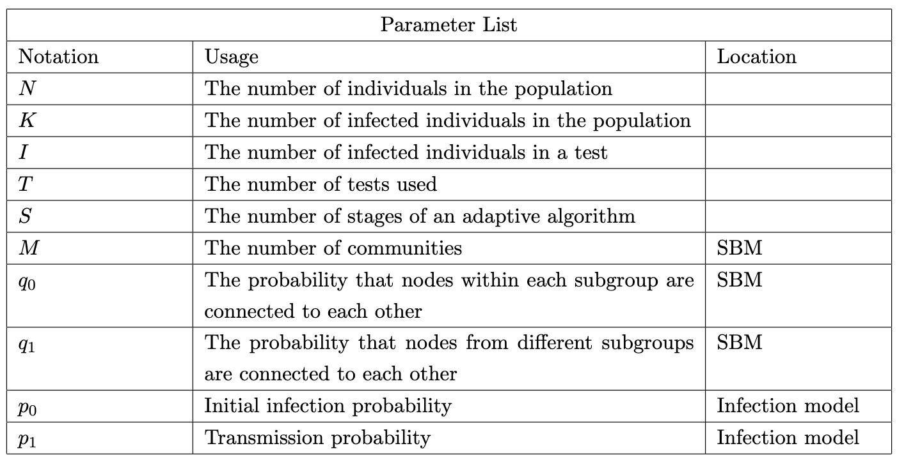

# Adaptive Testing with Non-Binary Output Group Tests

Project for applications of Graph Theory in Group testing. This mainly has 2 parts: 

1. Design adaptive algorithms that can better leverage non-binary output tests:

- Modern PCR testing variants offer more information than just binary output group tests (binary tests just output whether there exists any one infected person or not in the group). 
- The goal of this part is to design tree-based adaptive algorithms that leverage the outcomes
of these more informative tests to reduce the number of tests needed, as well as the number
of stages of adaptive testing.

2. Advanced: Adapt and apply these algorithms over populations with community structure

- Group testing typically assumes that
individuals in a population are infected independently from each other, say with a certain
probability p. Yet in reality, infections can be correlated; for instance, members of the same
family, are highly likely to all be infected or not infected. Community aware group testing was
shown to significantly reduce the number of tests needed, for some specific sets of correlations,
such as disconnected families, where the underlying community graph consists of disconnected
cliques.

- In this part of the project we want to see, if we can somehow use the adaptive algorithms that
we designed before, but now, knowing the underlying community structure, decide in which
leaf to place each individual, so that we can reduce the number of tests needed. We want
to compare such algorithms, that take community structure into account, against algorithms
that first randomly interleave all individuals, and then apply adaptive testing.

## Performance Metrics

## Programs

**Group testing:** We will consider the following group testing methods where we provide the
code:
1. Individual testing (use of N tests)
2. Binary splitting 
3. Diagonal splitting 

This is the part where we want you to be creative: we want you to come up with ideas on how
to leverage the enhanced testing capabilities to reduce the number of tests and the number
of stages if possible

Note that if you have tests that have non binary output capabilities, you can always quantize
their output to binary (not infected or at least one infected) and use these tests with the
previous methods, and thus you can compare over the same population the performance of
the non-binary output tests with the performance of binary splitting.

**Community graph**: In a community graph, each vertex corresponds to an individual; an
edge between two individuals indicates that they can infect each other. We will explore com-
munities connectivity described through the Stochastic Block Model (SBM). In this model,
we divide the N nodes into M subgroups of (almost) equal size. We assume that nodes within
each subgroup are connected to each other with probability q0. We assume that nodes are
connected to nodes in other subgroups with probability q1. Note that for q1=0 and q0 = 1
we get disconnected cliques; while for q0 = q1 we simply get a random Bernoulli graph.

**Infection Model**: The infection model we will consider is the following.
1. Initialization: Uniformly at random infect each member of the population with probability p0.
2. Transmission: Assume the graph has N nodes. We will assume 2 steps of infection, where
at each step, each infected member can infect each of their neighbors with probability
p1.

*Prepared By Utkarsh Lal and Anirudh Krishna*
